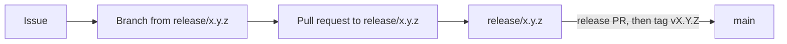

# Contributing

## How a change flows



- Every change starts from a GitHub issue.
- Branch from the current release branch, never from `main`. `main` only receives releases and hotfixes. The current release branch is the highest one in `git branch -r --list 'origin/release/*'`.
- Name the branch `<type>/<issue>-<short-slug>`, where type is `feature`, `fix`, `docs`, `test` or `chore`. Example: `fix/142-upload-empty-pdf`.
- Open the pull request against that release branch, with `Closes #<issue>` in the description.
- Urgent fix on a published version: branch `hotfix/...` from `main`, pull request to `main`.

## Set up

### With Docker

```bash
COMPOSE_PROFILES=default docker compose -f docker-compose.dev.yml up --build
```

Open <http://localhost:3000>. The frontend reloads on save (Vite) and so does the backend (`uvicorn --reload`). The backend port is not published: the Vite server forwards `/api` to it.

| Add this profile | To get |
|------------------|--------|
| `remote` | Docling Serve. Also set `CONVERSION_MODE=remote`. |
| `graph` | Neo4j |
| `ingestion` | OpenSearch, OpenSearch Dashboards, the embedding service and Neo4j |

Example: `COMPOSE_PROFILES=default,graph`. The dev file does not connect the backend to these services on its own. Put their addresses in `.env`:

```bash
OPENSEARCH_URL=http://opensearch:9200
EMBEDDING_URL=http://embedding:8001
NEO4J_URI=bolt://neo4j:7687
```

Working in several git worktrees? Prepare each one with `.development_scripts/worktree_setup.sh -s <main checkout> -w <worktree>`. Each can then run the `default` profile with its own `COMPOSE_PROJECT_NAME` and `FRONTEND_HOST_PORT`.

### Without Docker

Backend, with Python 3.12, [uv](https://docs.astral.sh/uv/) and poppler (`brew install poppler` or `apt install poppler-utils`), which renders the page previews:

```bash
cd document-parser
uv sync --group dev --group local
uv run uvicorn main:app --reload --port 8000
```

Add `--group reasoning` to `uv sync` if you need Ask. The API documentation is at <http://localhost:8000/docs>.

Frontend, with Node 20:

```bash
cd frontend
npm install
npm run dev
```

Open <http://localhost:3000>. `/api` is forwarded to <http://localhost:8000>.

## Before you push

Backend:

```bash
cd document-parser
uv run ruff check .
uv run ruff format --check .
uv run pytest tests/
```

Frontend:

```bash
cd frontend
npm run lint
npm run format:check
npm run type-check
npm run test:run
```

New behavior needs a test. The CI runs the lint, type-check and tests on every pull request. The format checks are yours to run.

### End-to-end tests

They use [Karate](https://karatelabs.github.io/karate/) and need Java 17, Maven, Python and Docker. The commands, with the settings the CI uses, are in [e2e/api/README.md](e2e/api/README.md) and [e2e/ui/README.md](e2e/ui/README.md). How to write a test: [e2e/CONVENTIONS.md](e2e/CONVENTIONS.md).

## Commits and pull requests

- Commit messages follow [Conventional Commits](docs/git-workflow/commit-conventions.md): `fix(upload): reject empty PDFs`.
- One issue per branch, one topic per pull request.
- User-visible change: add a line under `[Unreleased]` in [CHANGELOG.md](CHANGELOG.md).
- Fill in the pull request template.
- Reviews follow the [review checklist](docs/git-workflow/code-review-checklist.md), merges the [merge policy](docs/git-workflow/merge-policy.md).

## Bigger changes

- A new feature gets a design doc in `docs/design/`, named `<issue>-<slug>.md`. Copy the structure of a recent one.
- An architecture choice gets an [ADR](docs/architecture/adr-guide.md).
- Read [Architecture](docs/architecture.md) first.

## Bugs and security

- Bugs and ideas: open a [GitHub issue](https://github.com/scub-france/Docling-Studio/issues).
- Security problems: do not open a public issue. See [SECURITY.md](SECURITY.md).

## License

By contributing, you agree that your work is published under the [MIT license](LICENSE).
