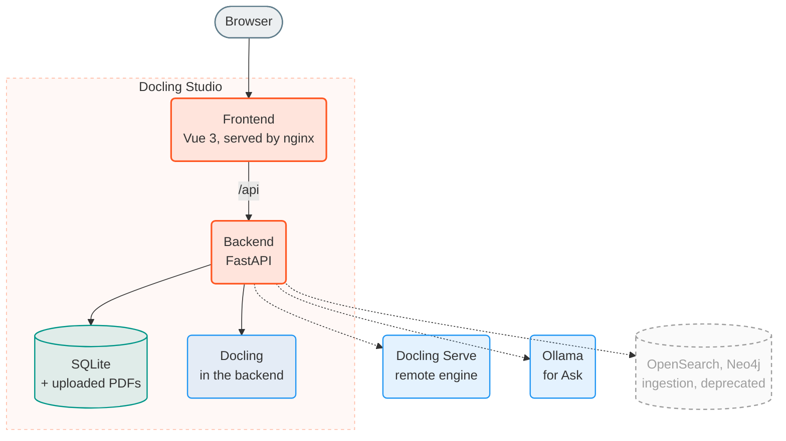
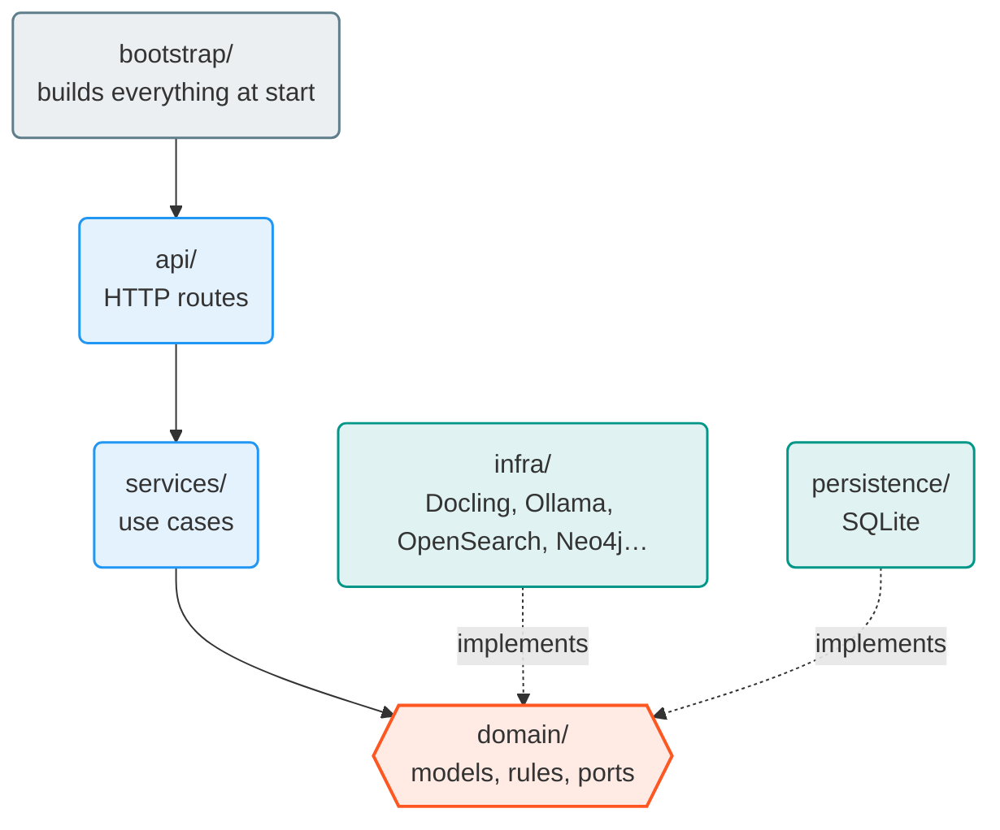
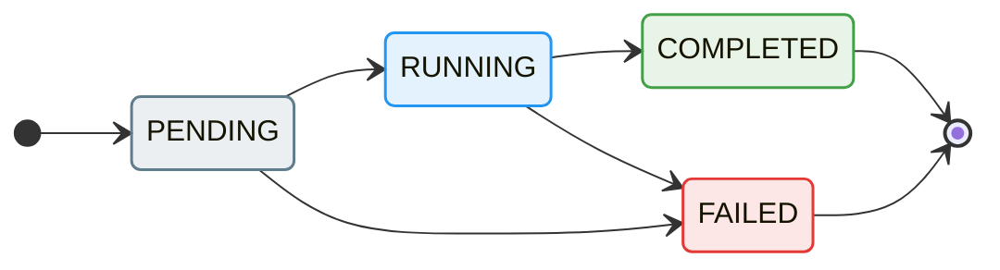

# Architecture

## The big picture

Dotted lines are optional. Grey and dashed means deprecated: ingestion (OpenSearch, Neo4j) goes away in 0.8.0. The published image puts nginx and the backend in one container (root `Dockerfile`). Docker Compose runs them as two containers.

| Folder | Content |
|--------|---------|
| `frontend/` | The web app: Vue 3, TypeScript, Vite, Pinia |
| `document-parser/` | The backend: FastAPI, Docling, SQLite |
| `embedding-service/` | Turns text into vectors, for ingestion only. Deprecated, removed in 0.8.0 |
| `e2e/` | End-to-end tests: Karate for the API, Karate UI in Chrome |
| `docs/` | This documentation, design docs, audit checklists |
| `experiments/`, `scripts/` | Research scripts and the demo recorder, not part of the app |

## Backend

The backend follows ports and adapters. The core (`domain/`) defines what the app needs; `infra/` and `persistence/` plug real tools into it.

`tests/test_architecture.py` fails when a layer imports what it must not:

| Layer | Never imports |
|-------|---------------|
| `domain` | Any other layer, FastAPI, SQLAlchemy, httpx, the OpenSearch client |
| `services` | `api`, `infra`, `persistence`, FastAPI |
| `api` | `infra`, `persistence` |
| `infra` | `api`, `services` |
| `persistence` | `api`, `services`, `infra` |

`main.py` creates the app and mounts the routes. `bootstrap/` builds the adapters and services from the settings.

### API rules

- JSON is camelCase; Python is snake_case. Page data from Docling keeps snake_case (`page_number`).
- One route does one domain operation. When a screen needs several calls, the frontend chains them in its store. The only exception is an operation that must be atomic, and its service says why. The route list and the reasoning behind this rule: [design doc 269](https://github.com/scub-france/Docling-Studio/blob/main/docs/design/269-backend-ddd-audit.md).

| Prefix | What it serves |
|--------|----------------|
| `/api/documents` | Documents, their chunks, versions, graph (Neo4j, deprecated), and Ask (`POST /api/documents/{id}/reasoning`) |
| `/api/analyses` | Analyses: start, read, delete |
| `/api/stores` | Ingestion targets (OpenSearch, Neo4j). Deprecated, removed in 0.8.0 |
| `/api/ingestion` | Sending chunks to stores, when ingestion is on. Deprecated, removed in 0.8.0 |
| `/api/config` | The reasoning settings edited in **Settings** |
| `/api/health` | Status, engine, version, and the flags the frontend reads |

### An analysis

An analysis waits in `PENDING` until the engine can take it: one at a time with the local engine, up to `MAX_CONCURRENT_ANALYSES` with Docling Serve, which also queues them on its side. The result is stored in SQLite: Markdown and HTML, the pages with their boxes, and the full Docling document as JSON.

### Ask

`api/reasoning.py` calls `services/reasoning_service.py`, which runs [docling-agent](https://github.com/docling-project/docling-agent) through a port (`ReasoningRunner`). The adapter is `infra/docling_agent_reasoning.py`. `domain/trace_builder.py` turns the agent's raw result into the steps shown in the timeline.

## Frontend

| Folder | Content |
|--------|---------|
| `src/app/` | App shell and router |
| `src/pages/` | One component per route, plus a few components only those pages use |
| `src/features/<name>/` | One feature: `api.ts`, `store.ts`, `ui/`, and `index.ts` |
| `src/shared/` | HTTP client, FR/EN texts, types, shared UI |

A feature uses another feature only through its `index.ts`. ESLint enforces it (`no-restricted-imports`).

On start, the app reads `/api/health`. The answer decides which pages exist (`STUDIO_MODE_ENABLED`, `RAG_PIPELINE_ENABLED`) and whether the Ask tab shows up.

## Going further

- [Bounding boxes](bbox-pipeline.md): how a Docling box becomes a rectangle on the page.
- [Design docs](https://github.com/scub-france/Docling-Studio/tree/main/docs/design): one per feature, named after its issue.
- [Architecture decisions](architecture/adr-guide.md), for example [ADR-001](architecture/adrs/ADR-001-graph-visualization-library.md) on the graph library.
