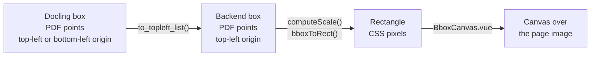

# Bounding boxes

How a box found by Docling becomes a rectangle drawn over the page preview.



## Coordinate spaces

| Space | Origin | Unit | Produced by |
|-------|--------|------|-------------|
| Docling | Bottom-left or top-left | PDF points | Docling |
| Backend | Top-left | PDF points | `document-parser/infra/bbox.py` |
| Screen | Top-left | CSS pixels | `frontend/src/shared/bboxScaling.ts` |

A Docling `BoundingBox` has four values, `l`, `t`, `r`, `b`, and a `coord_origin`:

- `BOTTOMLEFT`, the usual PDF origin: `y = 0` is the bottom of the page, so `t > b`.
- `TOPLEFT`: `y = 0` is the top of the page, so `t < b`.

A PDF point is 1/72 inch. A US Letter page is 612 × 792 pt, an A4 page 595 × 842 pt.

## Step 1: normalize (backend)

`to_topleft_list(bbox, page_height)` in `document-parser/infra/bbox.py`:

1. converts the box to a top-left origin with docling-core's `to_top_left_origin(page_height)`;
2. returns `[left, top, right, bottom]`;
3. returns `EMPTY_BBOX`, `[0, 0, 0, 0]`, when the width or height is zero or negative.

For a bottom-left box, the conversion flips the y axis:

```text
new_top    = page_height - old_top
new_bottom = page_height - old_bottom
```

Example on a US Letter page (792 pt high):

```text
Input:  l=50, t=700, r=200, b=600   (BOTTOMLEFT)
Output: [50, 92, 200, 192]           (TOPLEFT: 792 - 700 = 92, 792 - 600 = 192)
```

Every box the frontend draws comes out of this function: the page elements in an analysis's `pagesJson`, from either converter (`LocalConverter` or `ServeConverter`), and the boxes of each chunk.

### Missing page size

If Docling gives no size for a page, the backend uses US Letter (612 × 792 pt). Boxes on A4 or other sizes are then slightly off. The local converter (`document-parser/infra/local_converter.py`) logs a warning when this happens. The Docling Serve converter (`document-parser/infra/serve_converter.py`) falls back silently.

## Step 2: scale to pixels (frontend)

Two functions in `frontend/src/shared/bboxScaling.ts` do the math.

`computeScale(displayWidth, displayHeight, pageWidth, pageHeight)` returns pixels per point. The display size is the size of the page image on screen, so the resolution of the preview image does not matter.

```text
sx = displayWidth  / pageWidth
sy = displayHeight / pageHeight
```

`bboxToRect(bbox, scale)` turns `[l, t, r, b]` into a rectangle:

```text
x = l × sx
y = t × sy
w = (r - l) × sx
h = (b - t) × sy
```

Example: a 612 × 792 pt page shown at 700 × 906 px gives `sx ≈ sy ≈ 1.144`. The box `[50, 92, 200, 192]` becomes `x ≈ 57`, `y ≈ 105`, `w ≈ 172`, `h ≈ 114` px.

## Step 3: draw (frontend)

The Parse and Chunk tabs draw with `frontend/src/features/document/ui/BboxCanvas.vue`. `PagePreviewWithOverlay.vue` places one canvas over each page image. On each draw, `BboxCanvas`:

- sizes the canvas to the image's size on screen, in CSS pixels. It does not use `devicePixelRatio`, so lines can look slightly soft on high-density screens;
- computes the scale, then draws one rectangle per visible element;
- when elements are selected, dims the others and draws the selected ones last, with a thicker stroke and a dashed outline.

It redraws when the image is resized, and when the page, the elements, the hidden layers, the selection or the labels setting change. Hover and click use `pointInRect()` to find the element under the pointer.

The older Studio page (`/studio`, behind `STUDIO_MODE_ENABLED`) draws with `frontend/src/features/analysis/ui/BboxOverlay.vue` instead, which scales its canvas by `devicePixelRatio`.

## Degenerate boxes

| Case | Backend (`bbox.py`) | Frontend (`bboxScaling.ts`) |
|------|---------------------|-----------------------------|
| Zero or negative width or height | Returns `[0, 0, 0, 0]` | `bboxToRect` returns `EMPTY_RECT` |
| Page width or height of zero | Not applicable | `computeScale` returns `{ sx: 1, sy: 1 }` |

`BboxCanvas` skips rectangles with no area, so a degenerate box is never drawn.
