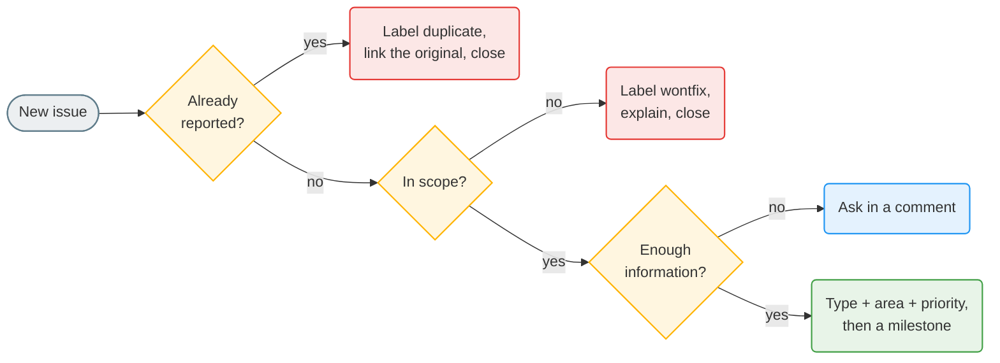

# Issue triage

## Labels

Only these labels exist on the repository.

| Kind | Labels |
|------|--------|
| Type | `bug`, `enhancement` (features too), `documentation`, `test`, `chore`, `question` |
| Priority | `P0` must have, `P1` should have, `P2` nice to have |
| Area | `backend`, `frontend`, `infra`, `architecture`, `search` |
| Outcome | `duplicate`, `invalid`, `wontfix` |
| Help | `good first issue`, `help wanted` |
| Automatic | `docling-compat`: opened by the daily Docling compatibility check when the tests fail against the latest Docling |

Issue titles start with a tag matching the type: `[BUG]`, `[FEATURE]`, `[ENHANCEMENT]`, `[DOC]`, `[TEST]`, `[CHORE]`.

## Triage a new issue

- Easy and well described? Add `good first issue`.
- Information still missing after 30 days: close with a comment. It can be reopened.

## Answering

- Every issue gets an answer, even "thanks, we will look next week".
- If it will not be fixed soon, say so.
- Close with a comment that explains the outcome.

There is no stale bot: closing old issues is done by hand.
