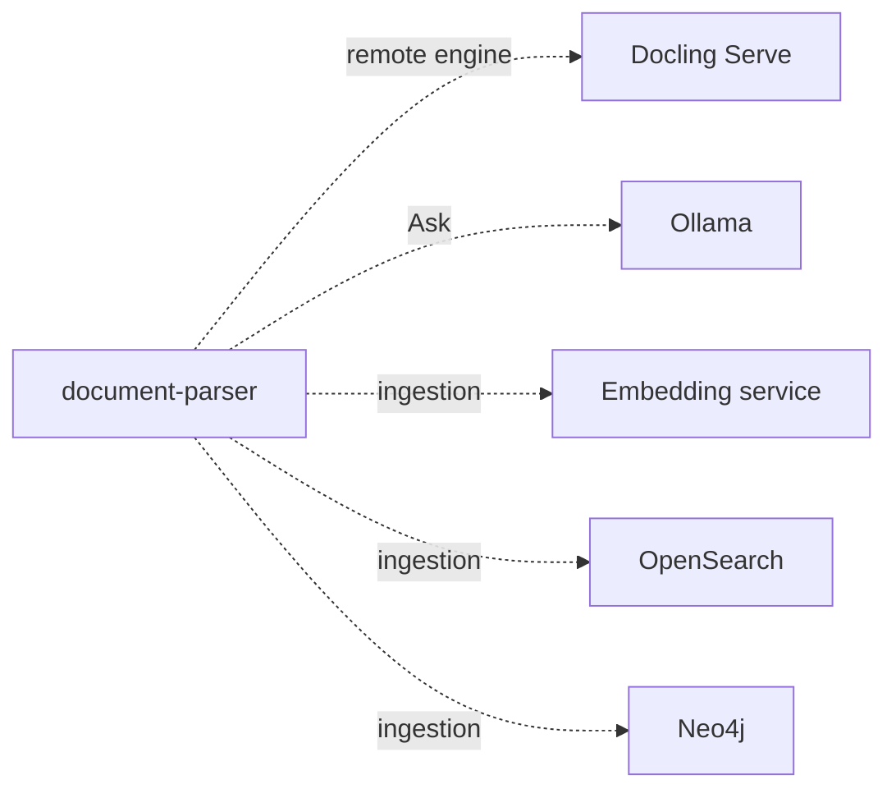

# Configuration

Docling Studio reads its settings from environment variables. This page lists the ones you are likely to change; the full list is in [`document-parser/infra/settings.py`](https://github.com/scub-france/Docling-Studio/blob/main/document-parser/infra/settings.py).

- With `docker run`, pass them with `-e NAME=value`.
- With Docker Compose, put them in a `.env` file next to `docker-compose.yml`. Compose only forwards the variables listed under `document-parser` › `environment` in `docker-compose.yml`. To set another one, add it there or in a `docker-compose.override.yml`.

The server checks most values when it starts. If one is invalid, it does not start and the logs say which one.

## Analysis

| Variable | Default | What it does |
|----------|---------|--------------|
| `CONVERSION_ENGINE` | `local` | `local`: Docling runs in the backend. `remote`: PDFs go to Docling Serve. The `-local` and `-remote` images set it for you. |
| `DOCLING_SERVE_URL` | `http://localhost:5001` | Docling Serve address. Remote engine only. |
| `DOCLING_SERVE_API_KEY` | empty | Key sent to Docling Serve, if it needs one. |
| `DEFAULT_TABLE_MODE` | `accurate` | How tables are read: `accurate` or `fast`. |
| `MAX_CONCURRENT_ANALYSES` | `3` | How many analyses run at the same time. |
| `CONVERSION_TIMEOUT` | `900` | Seconds before an analysis is stopped. |
| `BATCH_PAGE_SIZE` | `0` (compose: `10`) | Local engine only. Converts long PDFs in batches of this many pages. Batching drops the document structure, so the tree and Ask stop working on those PDFs. Keep `0` unless memory is short. |

Two more timeouts exist, in seconds: `DOCUMENT_TIMEOUT` (120) and `LOCK_TIMEOUT` (300). The server only starts if `DOCUMENT_TIMEOUT` < `LOCK_TIMEOUT` < `CONVERSION_TIMEOUT`. So a `CONVERSION_TIMEOUT` of 300 or less needs a lower `LOCK_TIMEOUT` as well.

## Limits

| Variable | Default | What it does |
|----------|---------|--------------|
| `MAX_FILE_SIZE_MB` | `50` | Largest upload, in MB. `0` means no limit. |
| `MAX_PAGE_COUNT` | `0` | Most pages per PDF. `0` means no limit. |
| `NGINX_MAX_BODY_SIZE` | `200M` | Upload limit in nginx, in nginx format. Keep it above `MAX_FILE_SIZE_MB`. |
| `RATE_LIMIT_RPM` | `100` | Requests per minute per client address, as the backend sees it. Behind the bundled nginx, that address is nginx itself, so all users share the limit. `0` turns it off. `/api/health` is not counted. |

## Ask

These are starting values. **Settings** › **Reasoning** in the app can change them while the server runs. After a **Save** there, the four values come from the database until you click **Reset to environment**.

| Variable | Default | What it does |
|----------|---------|--------------|
| `REASONING_ENABLED` | `false` | Turns Ask on. The reasoning packages must be in the image. |
| `OLLAMA_HOST` | `http://localhost:11434` | Ollama address, as seen from the backend. In a container, use `http://host.docker.internal:11434`. |
| `REASONING_MODEL_ID` | `gpt-oss:20b` | Default model. It must be pulled in Ollama. |
| `REASONING_MAX_ITERATIONS` | `5` | Most reasoning steps per question, from 1 to 20. |
| `LLM_PROVIDER_TYPE` | `ollama` | Only `ollama` works. |

## Feature switches

| Variable | Default | What it does |
|----------|---------|--------------|
| `RAG_PIPELINE_ENABLED` | `true` | The Docs and Runs pages. |
| `STUDIO_MODE_ENABLED` | `false` | The older Studio pages (`/studio`, `/history`, `/documents`, `/search`), which still hold chunking and ingestion. |

At least one of the two must be `true`.

## Optional services



None of them is needed to import and analyze PDFs.

Ingestion sends chunks to OpenSearch or Neo4j. It turns on when `EMBEDDING_URL` is set together with `OPENSEARCH_URL` or `NEO4J_URI`. In 0.7.3 only the older Studio pages use it, so it also needs `STUDIO_MODE_ENABLED=true`.

| Variable | Default | What it does |
|----------|---------|--------------|
| `EMBEDDING_URL` | empty | Embedding service address. Empty means no ingestion. |
| `OPENSEARCH_URL` | empty | OpenSearch address. Empty means OpenSearch is not used. |
| `EMBEDDING_DIMENSION` | `384` | Vector size. It must match the embedding model. |
| `NEO4J_URI` | empty | Neo4j address, for example `bolt://neo4j:7687`. Empty means Neo4j is not used. |
| `NEO4J_USER`, `NEO4J_PASSWORD` | `neo4j`, `changeme` | Neo4j login. Change the password. |
| `STORE_SECRET_KEY` | empty | Encrypts store passwords in the database. Required as soon as a store has a password, and it must never change. |

Create a `STORE_SECRET_KEY` with the image itself:

```bash
docker run --rm ghcr.io/scub-france/docling-studio:latest-remote python -c "from cryptography.fernet import Fernet; print(Fernet.generate_key().decode())"
```

With Docker Compose, the `ingestion` profile starts OpenSearch, the embedding service and Neo4j, and the extra file connects the first two:

```bash
docker compose --profile ingestion -f docker-compose.yml -f docker-compose.ingestion.yml up --build
```

For Neo4j, also put `NEO4J_URI=bolt://neo4j:7687` in `.env`. The embedding service reads `EMBEDDING_MODEL` (default `all-MiniLM-L6-v2`).

These compose settings are for a laptop: OpenSearch runs without security and Neo4j with the default password. Do not expose them.

## Deployment

| Variable | Default | What it does |
|----------|---------|--------------|
| `DEPLOYMENT_MODE` | `self-hosted` | `huggingface` shows a demo banner and makes **Settings** › **Reasoning** read-only. |
| `CORS_ORIGINS` | `http://localhost:3000,http://localhost:5173` | Browser origins allowed to call the API, comma-separated. Only needed when the UI is served from another address. |
| `UPLOAD_DIR` | `/app/uploads` in the images | Folder for uploaded PDFs. |
| `DB_PATH` | `/app/data/docling_studio.db` in the images | SQLite database: documents, analyses, stores and settings saved in the app. |
| `APP_VERSION` | `dev` | Version shown in the app. The release build sets it. |

## Build options

Used when you build the image yourself, with `docker build --build-arg` or as variables for `docker compose up --build`.

| Name | Default | What it does |
|------|---------|--------------|
| `CONVERSION_MODE` | `local` | Compose only. Which image to build: `local` or `remote`. |
| `WITH_REASONING` | `false` | Installs the packages Ask needs. `local` image only. |
| `BAKE_MODELS` | `false` | Downloads Docling's models into the image at build time. `local` image only. The backend does not point Docling at this copy yet, so the first analysis still downloads them. |
| `APP_VERSION` | `dev` | Version baked into the single image (root `Dockerfile`). |

Example, the single image with Ask:

```bash
docker build --target local --build-arg WITH_REASONING=true -t docling-studio .
```

## Where data lives

| Setup | Database and PDFs |
|-------|-------------------|
| `docker run` | Inside the container, in `/app/data` and `/app/uploads`. Mount volumes to keep them. |
| `docker-compose.yml` | Docker volumes `db_data` and `uploads_data`. |
| `docker-compose.dev.yml` | `document-parser/data` and `document-parser/uploads` in your clone. |
