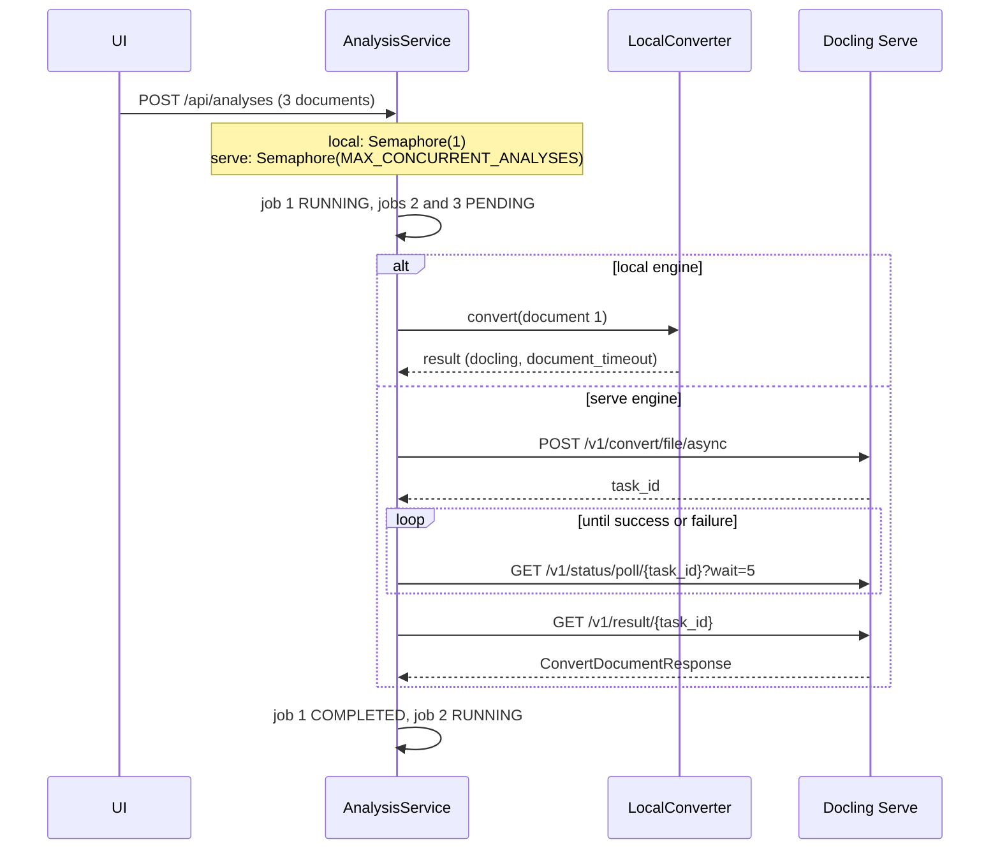

# Design: Queue analyses and convert long PDFs in one go, as docling and Docling Serve do

<!--
Design doc template for Docling Studio.

One design doc per tracked issue. File path convention:
  docs/design/<issue-number>-<kebab-slug>.md

Status lifecycle: Draft → In review → Accepted → Implemented (or Superseded).
Bump the Status line as the doc progresses; do not delete sections on the way.

This template is tailored to the project's architecture and conventions:
  - Backend Hexagonal Architecture / ports & adapters
    (domain → api/services/persistence/infra)
    see docs/architecture.md
  - Backend coding standards (FastAPI + Pydantic camelCase, aiosqlite,
    Python snake_case internal, max 300 lines/file, 30 lines/function)
    see docs/architecture/coding-standards.md
  - Frontend feature-based organization (Vue 3 + Pinia, one store per
    feature, Composition API, TypeScript strict, data-e2e selectors)
  - E2E with Karate UI (NOT Playwright) — see e2e/CONVENTIONS.md
  - Audit dimensions used at release gate — see docs/audit/master.md
  - ADR process for load-bearing decisions — see docs/architecture/adr-guide.md

The `/conception` command pre-fills the header block and §1 / §2 / §12 from
the linked issue. Everything else is on the author.
-->

- **Issue:** #349
- **Title on issue:** [ENHANCEMENT] Queue analyses and convert long PDFs in one go, as docling and Docling Serve do
- **Author:** Pier-Jean Malandrino
- **Date:** 2026-09-28
- **Status:** Accepted
- **Target milestone:** 0.7.3
- **Impacted layers:** backend: domain · services · infra · frontend: `features/analysis` · `shared/i18n` · e2e · infra/CI (compose files)
- **Audit dimensions likely touched:** Hexagonal Architecture · KISS · Decoupling · Performance · Tests · Documentation
- **ADR spawned?:** no — "no Studio-side page progress" is recorded here (§3, §6 E), see §11

---

## 1. Problem

Studio fails on the two things a corpus needs: several documents at once, and long documents. The first version of this issue (PR #351) answered with page batches by default. Neither docling nor Docling Serve works that way, and the batches hid what actually breaks:

- **Local engine, several files.** `infra/local_converter.py::_convert_sync` takes a global `_converter_lock` with `LOCK_TIMEOUT` (300 s), while `AnalysisService` lets `MAX_CONCURRENT_ANALYSES` (3) analyses run at once. When the first conversion lasts more than 5 minutes, the analyses waiting on the lock fail with "Server busy". Batch analysis (#354) starts many analyses at once, so this becomes the common case.
- **Local engine, long files.** `DOCUMENT_TIMEOUT` (120 s) stops docling: a 28-page paper stopped after page 19. #348 now fails such analyses and names the missing pages, but they still fail.
- **Serve engine, both.** `ServeConverter` calls the synchronous `POST /v1/convert/file`. Docling Serve waits at most `DOCLING_SERVE_MAX_SYNC_WAIT` (120 s by default, not raised in our compose), then answers 504 while the task keeps running on its side. Time spent in Serve's own queue counts too.

Docling converts a document in one call, bounds memory with internal page batches (`DOCLING_PERF_PAGE_BATCH_SIZE`), and stops cleanly at its `document_timeout`. Docling Serve queues tasks behind its workers and offers an asynchronous API: submit, poll the status, fetch the result. Studio should behave the same way, with both engines.

## 2. Goals

- [ ] Local: conversions run one at a time, queued analyses stay `PENDING` and start in order of creation, and none fails with "Server busy" while waiting.
- [ ] Serve: `ServeConverter` submits to `/v1/convert/file/async`, polls `/v1/status/poll/{task_id}`, and fetches `/v1/result/{task_id}`. A failed or lost task fails the analysis with Serve's reason.
- [ ] Serve: `document_timeout` is sent with every conversion.
- [ ] Timeouts: `DOCUMENT_TIMEOUT` defaults inside `CONVERSION_TIMEOUT`, and the startup check still holds.
- [ ] `BATCH_PAGE_SIZE` defaults to 0 in `Settings`, `.env.example` and both compose files.
- [ ] Frontend: the document page keeps following a queued analysis, and its 15-minute limit starts when the analysis is `RUNNING`.
- [ ] PR #351 no longer changes the `BATCH_PAGE_SIZE` default to 10. Docs and CHANGELOG follow.

## 3. Non-goals

- **A progress percentage.** Neither docling nor Docling Serve reports page progress: Serve's `task_meta` counts documents, not pages. The percentage of #344 stays tied to the opt-in `BATCH_PAGE_SIZE`. Not planned.
- **The position in the queue, in the UI.** Docling Serve returns `task_position`, and the local queue could compute a rank. Follow-up issue once the queue is in.
- **Cancelling an analysis.** Docling Serve has no abort API yet (`# TODO: abort task!` in `docling_serve/app.py`). Follow-up, once upstream offers one.
- **Several local conversions at once.** Docling Serve's local engine runs several workers, each with its own models (`DOCLING_SERVE_ENG_LOC_NUM_WORKERS`). Studio keeps one in-process converter; scaling goes through the Serve engine.
- **Recovering analyses cut by a restart.** Queued and running analyses live in memory. After a restart, their jobs stay `PENDING` or `RUNNING`. That is already true of running analyses today; separate issue.
- **Removing `BATCH_PAGE_SIZE` and the batch merge (#344).** Both stay, as an opt-in for memory-bound local setups.

## 4. Context & constraints

### Existing code surface

- Backend:
  - `document-parser/domain/ports.py`: the `DocumentConverter` port.
  - `document-parser/infra/local_converter.py`: `_converter_lock`, `_convert_sync`, `LocalConverter`.
  - `document-parser/infra/serve_converter.py`: `ServeConverter.convert`, `_post_convert_with_startup_retry`, `_build_form_data`, `_parse_response`. Already 402 lines, over the 300-line standard.
  - `document-parser/infra/settings.py`: the timeouts, `batch_page_size`, and the startup cascade check.
  - `document-parser/services/analysis_service.py`: `asyncio.Semaphore(max_concurrent)`; `_run_analysis` enters it, then `_run_analysis_inner` calls `mark_running`; `_run_conversion` wraps the conversion in `asyncio.wait_for(..., conversion_timeout)`.
  - `document-parser/bootstrap/factories.py`: builds `ServeConverter(base_url, api_key, timeout=conversion_timeout)` and the service with `max_concurrent=settings.max_concurrent_analyses`.
- Frontend:
  - `frontend/src/features/analysis/store.ts`: `startPolling`, with `MAX_POLLING_DURATION` (15 min) armed at launch.
  - `frontend/src/features/analysis/progress.ts` and `ui/AnalysisProgressBar.vue` (#344): the strip under the document header.
- Config and docs: `docker-compose.yml`, `docker-compose.dev.yml`, `.env.example`, `docs/configuration.md`, `docs/troubleshooting.md`, `docs/user-guide.md`, `docs/architecture.md`, `docs/operations/monitoring-checklist.md`.
- E2E: `e2e/api/src/test/resources/analyses/batch-progress.feature` accepts both a batched and a single-pass conversion.

### Hexagonal constraints

- One port change: `DocumentConverter` gains a read-only capability, `max_parallel_conversions`. The service reads it without knowing which adapter sits behind the port.
- Docling Serve's task API is an HTTP detail. It stays in `infra/`, in a new `infra/serve_tasks.py` that only `ServeConverter` uses.
- No change in the domain models, in persistence, or in Studio's API.

### Deployment modes

- `latest-local` (local engine): the queue of one and the new timeouts.
- `latest-remote` (Serve engine), the HF Space included: the asynchronous API. It needs Docling Serve's `/v1` asynchronous routes. The compose pins `v1.21.0`, which has `/v1/convert/file/async`, `/v1/status/poll/{task_id}` with its `wait` parameter, and `/v1/result/{task_id}`.
- No feature flag: both engines move to the new behavior. The `chunking` and `disclaimer` flags are untouched.

### Hard constraints

- The startup cascade `DOCUMENT_TIMEOUT < LOCK_TIMEOUT < CONVERSION_TIMEOUT` (`infra/settings.py`) must keep holding, defaults included.
- Docling Serve results are single-use by default, and removed 300 s after completion (`DOCLING_SERVE_SINGLE_USE_RESULTS`, `DOCLING_SERVE_RESULT_REMOVAL_DELAY`). Studio must fetch each result once, soon after completion.
- No schema change and no change to Studio's API contract.

## 5. Proposed design

### 5.1 Domain

On the `DocumentConverter` port (`domain/ports.py`):

```python
@property
def max_parallel_conversions(self) -> int | None:
    """How many conversions the engine runs at once, or None when the engine
    queues extra work itself (Docling Serve). The analysis service never hands
    it more, and keeps the rest PENDING in its own queue."""
    ...
```

Nothing else changes in the domain. `IncompleteConversionError` (#348) keeps reporting a conversion that the timeout cut.

### 5.2 Persistence

None. `PENDING` already means "created, not started", and a job only turns `RUNNING` once it leaves the queue, since `mark_running` runs inside the semaphore.

### 5.3 Infra adapters

**`infra/local_converter.py`**

- `LocalConverter.max_parallel_conversions = 1`: one in-process converter, with its models loaded once.
- `_converter_lock` stays, as a guard. When `CONVERSION_TIMEOUT` expires, the service stops waiting, but the docling thread runs on until its own `document_timeout`. The next conversion waits for it on the lock, up to `LOCK_TIMEOUT`.

**`infra/serve_tasks.py` (new)**, a small client for Docling Serve's task API, one call per route:

| Call | Route | Result |
|---|---|---|
| `submit(files, form)` | `POST /v1/convert/file/async` | The task id. Keeps the 404 retry on Docling Serve startup that `_post_convert_with_startup_retry` does today. |
| `wait_for_completion(task_id)` | `GET /v1/status/poll/{task_id}?wait=5`, repeated | Returns once `task_status` is `success`. Raises with Serve's `error_message` on `failure`, and on a 404 (task lost, for example after a Serve restart). |
| `fetch_result(task_id)` | `GET /v1/result/{task_id}` | The `ConvertDocumentResponse` JSON, the body the synchronous route returns today. |

The `wait` long-poll keeps requests few (about one every 5 s per analysis running on Serve; outbound, so Studio's rate limiter does not see them) and fetches the result right after completion, well within the 300 s removal delay. The client lives in its own module so that `serve_converter.py`, already over the 300-line standard, does not grow; the startup retry moves there.

**`infra/serve_converter.py`**

- `convert()` builds the form as today, plus `document_timeout`, then chains `submit`, `wait_for_completion` and `fetch_result`, and hands the body to `_parse_response`. That function is unchanged and keeps the #348 check for partial results.
- `max_parallel_conversions = None`: Docling Serve queues what its workers cannot take yet.
- The constructor takes `document_timeout`, which `bootstrap/factories.py` fills from `settings.document_timeout`.

**`infra/settings.py`**

- `batch_page_size` defaults to 0 again, which reverts the first version of PR #351.
- When they are not set, the timeouts derive from the analysis budget:
  - `CONVERSION_TIMEOUT`: 900 s, unchanged. It is the budget of one analysis, counted from the moment it leaves the queue.
  - `DOCUMENT_TIMEOUT`: two minutes less, so 780 s. Docling stops cleanly before Studio gives up, with the pages converted so far; #348 names the others.
  - `LOCK_TIMEOUT`: one minute less, so 840 s. It only guards the case above, where a conversion still finishes after its analysis gave up.
  - Under a 4-minute budget, the margins would go negative, so the defaults become half and three quarters of `CONVERSION_TIMEOUT`: `max(budget − 120, budget / 2)` and `max(budget − 60, 3 × budget / 4)`. The order `DOCUMENT_TIMEOUT < LOCK_TIMEOUT < CONVERSION_TIMEOUT` holds for any budget.
  - The cascade check stays as it is.

**Compose files**

- `BATCH_PAGE_SIZE: ${BATCH_PAGE_SIZE:-0}` in `docker-compose.yml` and `docker-compose.dev.yml`.

### 5.4 Services

`AnalysisService.__init__` sizes its semaphore with the engine's capacity:

```python
limit = converter.max_parallel_conversions
self._semaphore = asyncio.Semaphore(min(max_concurrent, limit) if limit else max_concurrent)
```

- **Local engine:** a queue of one. `asyncio.Semaphore` wakes its waiters in FIFO order, and `create()` schedules one task per analysis as it creates it, so analyses start in order of creation. They stay `PENDING` until then.
- **Serve engine:** up to `MAX_CONCURRENT_ANALYSES` analyses are handed over, and Docling Serve queues the rest behind its workers. Studio shows them `RUNNING` from the hand-over; the position in Serve's queue is a non-goal.
- `CONVERSION_TIMEOUT` (`asyncio.wait_for` in `_run_conversion`) starts after the semaphore, so time in Studio's queue never counts. With the Serve engine, time in Docling Serve's queue does.
- `_run_batched_conversion` is unchanged, for the opt-in.



### 5.5 API

None. `GET /api/analyses` and `GET /api/analyses/summaries` (#354) already report `PENDING` and `RUNNING`.

### 5.6 Frontend — feature module

In `frontend/src/features/analysis/`:

- `store.ts`, `startPolling`: the 15-minute limit (`MAX_POLLING_DURATION`) is armed when the polled analysis is first seen `RUNNING`, not at launch. A queued run is followed for as long as it waits.
- `progress.ts`: `analysisProgress` gains a `queued` kind for `PENDING`.
- `ui/AnalysisProgressBar.vue`: shows *En attente* / *Queued* for it, then the time elapsed since `startedAt` once `RUNNING`. The strip keeps `data-e2e="analysis-progress"` and gains `data-state="queued" | "running"`.

Nothing else changes: the Analysis library of #354 already shows `PENDING`.

### 5.7 Cross-cutting (feature flags, i18n, shared types)

- i18n: `analyses.progressQueued` (FR *En attente*, EN *Queued*).
- No feature flag and no shared type change.
- Docs:
  - `configuration.md`: the timeouts and their derivation, `BATCH_PAGE_SIZE` at 0, `MAX_CONCURRENT_ANALYSES` capped at one conversion with the local engine, the minimum Docling Serve.
  - `troubleshooting.md`: why an analysis stays `PENDING`, and what "Server busy" still means.
  - `user-guide.md`: its sentences on the progress bar (#357) and on batch analysis (#355) no longer promise a percentage or three analyses at a time. Both PRs were merged first, so the fix lands here.
  - `architecture.md` and `operations/monitoring-checklist.md`: an analysis waits in `PENDING` until the engine can take it, one at a time with the local engine.
  - `.env.example` and the CHANGELOG.

## 6. Alternatives considered

### Alternative A — page batches by default (the first version of PR #351)

- **Summary:** convert every long PDF in slices of 10 pages and merge them with `DoclingDocument.concatenate` (#344). Each slice gets its own timeout and releases the lock between slices, which hides the local queue problem, and the slices give a percentage.
- **Why not:** a Studio-only layer on top of docling, for the local engine only. It splits a table that runs across two slices, and makes the two engines behave differently. It masks the lock timeout and the Serve 504 instead of fixing them.

### Alternative B — raise `DOCLING_SERVE_MAX_SYNC_WAIT` instead of using the asynchronous API

- **Summary:** keep the synchronous route, and set a long sync wait in our compose.
- **Why not:** it only fixes our compose, not a Docling Serve deployed elsewhere (the HF Space, user deployments). An HTTP request held open for 15 minutes is fragile behind proxies, and gives no status on the way.

### Alternative C — wait on the lock without a timeout, with the local engine

- **Summary:** drop `LOCK_TIMEOUT`, and let conversions block on the lock until their turn.
- **Why not:** a thread blocked on a lock cannot be cancelled, the analysis turns `RUNNING` while it only waits, and the wait eats its `CONVERSION_TIMEOUT`.

### Alternative D — several local workers

- **Summary:** one converter per worker, each with its own models, as Docling Serve's local engine does.
- **Why not now:** one set of models per worker costs memory on the machines that run the local image, and the Serve engine already scales that way.

### Alternative E — an estimated or hooked page percentage

- **Summary:** estimate the progress from past analyses, or count pages through docling's internal pipeline.
- **Why not:** an estimate is not progress, and hooking private docling code breaks on upgrades. Decision on the issue: when docling does not report it, Studio does not either.

## 7. API & data contract

### Endpoints

Studio: no change.

Docling Serve, called by the Serve engine:

| Method | Path | Request | Response | Breaking? |
|--------|------|---------|----------|-----------|
| POST | `/v1/convert/file/async` | multipart: `files` and the conversion options, now with `document_timeout` | `TaskStatusResponse` (`task_id`, `task_status`, `task_position`) | Needs Serve's `/v1` asynchronous routes (present in the pinned v1.21.0) |
| GET | `/v1/status/poll/{task_id}?wait=5` | — | `TaskStatusResponse`: `task_status` is `pending`, `started`, `success` or `failure`; `error_message` | — |
| GET | `/v1/result/{task_id}` | — | `ConvertDocumentResponse`, as the synchronous route returns today | — |
| POST | `/v1/convert/file` | — | No longer called | — |

### Persistence schema

No change.

### Env vars / config

| Name | Default | Allowed | Notes |
|------|---------|---------|-------|
| `CONVERSION_TIMEOUT` | 900 | > `LOCK_TIMEOUT` | Budget of one analysis, from the moment it leaves the queue. |
| `DOCUMENT_TIMEOUT` | `max(CONVERSION_TIMEOUT − 120, CONVERSION_TIMEOUT / 2)` (780) | > 0, < `LOCK_TIMEOUT` | Was 120. Now also sent to Docling Serve. |
| `LOCK_TIMEOUT` | `max(CONVERSION_TIMEOUT − 60, 3 × CONVERSION_TIMEOUT / 4)` (840) | < `CONVERSION_TIMEOUT` | Was 300. Guards a conversion that still finishes after its analysis gave up. |
| `MAX_CONCURRENT_ANALYSES` | 3 | ≥ 1 | Local engine: capped at one conversion; the rest queue. |
| `BATCH_PAGE_SIZE` | 0 (compose: 0, was 10) | ≥ 0 | Opt-in page batches for memory-bound local setups. |

### Breaking changes

- Compose users lose the page percentage, which came with `BATCH_PAGE_SIZE=10`. Setting it again brings it back.
- Deployments that set `DOCUMENT_TIMEOUT` or `LOCK_TIMEOUT` explicitly keep their values, and the cascade check still applies to them.
- The Serve engine needs Docling Serve's asynchronous routes.

## 8. Risks & mitigations

| Risk | Audit dimension | Likelihood | Impact | How we notice | Mitigation / rollback |
|------|-----------------|------------|--------|---------------|------------------------|
| Docling Serve keeps converting after Studio gave up (no abort API) | Performance | Medium | Low | Serve logs and CPU | `document_timeout` is now sent, so Serve stops at the same budget. Abort is a non-goal until upstream ships it. |
| The single-use result is lost if its one fetch fails | Tests | Low | Medium | Analysis `FAILED`, "result not found" | The long-poll fetches right after completion, and one retry covers a transient network error. |
| Queued analyses stay `PENDING` for good after a restart (in-memory queue) | Tests | Medium | Medium | `PENDING` rows that never move | Already true of running analyses. Follow-up issue to mark interrupted jobs `FAILED` at startup. |
| With a queue of one, a long analysis holds up short ones | Performance | Medium | Low | Long `PENDING` times in the library | That is the engine's real capacity. The Serve engine scales; the queue position is a follow-up. |
| Derived timeout defaults surprise a deployment that sets only one of the three | Documentation | Low | Low | The cascade check stops the server at startup | Its error names the three values, and `configuration.md` documents the derivation. |
| A new port property ties the service to engine capabilities | Hexagonal Architecture | Low | Low | Architecture tests | A read-only capability on the port, implemented by both adapters; no adapter import in services. |
| An older Docling Serve without the asynchronous routes | Decoupling | Low | High | 404 on submit, after the startup retries | The compose pins v1.21.0, and `configuration.md` states the minimum. |

## 9. Testing strategy

### Backend — pytest (`document-parser/tests/`)

- `test_analysis_service.py`: with a fake converter whose `max_parallel_conversions` is 1 and whose `convert` waits on an `asyncio.Event`, start three analyses. The second and third stay `PENDING` while the first runs, then start in order, and none fails with "Server busy". With `None`, the three run at once.
- `test_serve_tasks.py` (new): submit (task id, 404 retry during startup), wait (`pending` then `started` then `success`; `failure` with its `error_message`; 404 for a lost task), fetch. With a mocked `httpx.AsyncClient`, as in `test_serve_converter.py`.
- `test_serve_converter.py`: `convert()` chains submit, wait and fetch, sends `document_timeout`, and still fails a partial result (#348).
- `test_settings.py`: the derived defaults (780, 840, 900), explicit values winning, the cascade check still firing, `batch_page_size` at 0.
- `test_architecture.py`: unchanged, stays green.

### Frontend — Vitest (`frontend/src/**/*.test.ts`)

- `store.test.ts`: a run polled `PENDING` for more than 15 minutes is still followed; the limit applies from its first `RUNNING`.
- `progress.test.ts`: the `queued` kind for `PENDING`.
- `i18n.test.ts`: `analyses.progressQueued`.

### E2E — Karate UI (`e2e/`)

- API: `batch-progress.feature` already accepts a single-pass conversion; its batched assertions stay conditional.
- UI: `docs-batch-analysis.feature` (#354) runs several analyses through the queue. Karate cannot reproduce a 5-minute wait, so pytest covers the queue rule.

### Manual QA

1. Local compose: batch-analyse the 28-page arXiv paper at the repo root three times. All three complete, two of them *Queued* first, and none fails with "Server busy".
2. Remote compose (`--profile remote`): analyse the same paper. It completes after the 2-minute mark, with no 504.

### Performance / load

About one outbound poll every 5 s per analysis running on Docling Serve. Local throughput does not change: the lock already ran conversions one at a time.

## 10. Rollout & observability

### Release branch

`release/0.7.3`, through PR #351, whose first version is reverted in the same PR.

### Feature flag / staged rollout

None: both engines move together. `BATCH_PAGE_SIZE` keeps its opt-in role.

### Observability

- `INFO` when an analysis waits in the queue ("queued, the engine runs N at a time") and when it starts.
- `INFO` when a Docling Serve task is submitted for an analysis, and its final status. `WARNING` for a lost task.
- New `FAILED` messages to watch in `analysis_jobs`: a Docling Serve task failure (with Serve's reason), and a lost task.

### Rollback plan

- Revert the PR. There is no migration and no data to clean.
- Without a redeploy: `BATCH_PAGE_SIZE=10` restores the page batches and their percentage, and `DOCUMENT_TIMEOUT=120 LOCK_TIMEOUT=300` restores the old timeouts. The asynchronous API has no switch; the fallback is Alternative B, a raised `DOCLING_SERVE_MAX_SYNC_WAIT`.

## 11. Open questions

Resolved at acceptance:

- Analyses cut by a restart: marked `FAILED` at startup in a follow-up issue, not here.
- Docling Serve's long-poll `wait`: 5 s.
- "No Studio-side page progress": no ADR. The decision is recorded in §3 and §6 E, and follows from the libraries.

## 12. References

- **Issue:** https://github.com/scub-france/docling-Studio/issues/349
- **Related PRs / commits:** #351 (this rework), #347 (batch merge, #344), #350 (incomplete conversions, #348), #355 (batch analysis, #354)
- **ADRs:** none planned
- **Project docs:**
  - Architecture: `docs/architecture.md`
  - Coding standards: `docs/architecture/coding-standards.md`
  - ADR guide / template: `docs/architecture/adr-guide.md`, `docs/architecture/adr-template.md`
  - Audit master: `docs/audit/master.md`
  - E2E conventions: `e2e/CONVENTIONS.md`
- **External:**
  - Docling Serve configuration (`DOCLING_SERVE_MAX_SYNC_WAIT`, `DOCLING_SERVE_MAX_DOCUMENT_TIMEOUT`, `DOCLING_SERVE_SINGLE_USE_RESULTS`, `DOCLING_SERVE_RESULT_REMOVAL_DELAY`): https://github.com/docling-project/docling-serve/blob/main/docs/configuration.md
  - Docling Serve asynchronous API: https://github.com/docling-project/docling-serve/blob/main/docs/usage.md
  - The 504 after the sync wait: `docling_serve/app.py` (v1.21.0)
  - Docling's internal page batches: `DOCLING_PERF_PAGE_BATCH_SIZE`, `docling/datamodel/settings.py`
