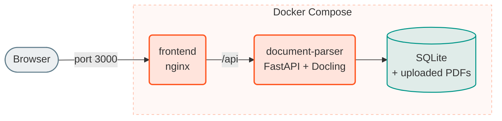

# Get started

There are three ways to run Docling Studio:

| Way | Use it to | You need |
|-----|-----------|----------|
| [Docker image](#run-the-docker-image) | Try it, or install it on one server | Docker |
| [Docker Compose](#run-with-docker-compose) | Build it from this repository | Docker and a clone of the repo |
| From source | Work on the code | See [Contributing](https://github.com/scub-france/Docling-Studio/blob/main/CONTRIBUTING.md) |

## Run the Docker image

```bash
docker run -p 3000:3000 ghcr.io/scub-france/docling-studio:latest-local
```

Open <http://localhost:3000>. The [user guide](user-guide.md) walks you through the screens.

This image runs Docling inside the container, on CPU. No GPU is needed, and it works on Intel and ARM machines (Apple Silicon included). Give Docker at least 6 GB of memory; 8 GB is better.

The first analysis is slower than the next ones: Docling downloads its models from HuggingFace at that moment.

### Keep your data

Without volumes, your documents and analyses are lost when the container is removed. Mount two volumes to keep them:

```bash
docker run -p 3000:3000 -v docling-data:/app/data -v docling-uploads:/app/uploads ghcr.io/scub-france/docling-studio:latest-local
```

### Image tags

| Tag | What you get |
|-----|--------------|
| `latest-local` | Latest release. Docling runs in the container. Includes Ask. |
| `latest-remote` | Latest release, much smaller. Docling runs on a [Docling Serve](https://github.com/docling-project/docling-serve) server you provide. No Ask. |
| `X.Y.Z-local`, `X.Y-local` | A fixed version (for example `0.7.2-local`), or the latest patch of a minor version. Same with `-remote`. |

To use the remote image, point it at your Docling Serve server:

```bash
docker run -p 3000:3000 -e DOCLING_SERVE_URL=http://my-docling-serve:5001 ghcr.io/scub-france/docling-studio:latest-remote
```

Add `-e DOCLING_SERVE_API_KEY=...` if the server needs a key.

## Run with Docker Compose

This builds the app from the repository.

```bash
git clone https://github.com/scub-france/Docling-Studio.git
cd Docling-Studio
docker compose up --build
```

Open <http://localhost:3000>. Two containers run:



Two things to know before your first analysis:

- **The first analysis is slow.** Docling downloads its models from HuggingFace at that moment.
- **Long PDFs need `BATCH_PAGE_SIZE=0`.** The compose file sets it to 10, which splits PDFs of more than 10 pages and loses their structure: the tree stays empty and Ask cannot read them. Put `BATCH_PAGE_SIZE=0` in a `.env` file next to `docker-compose.yml`.

To use Docling Serve instead of running Docling in the backend:

```bash
CONVERSION_MODE=remote docker compose --profile remote up --build
```

OpenSearch and Neo4j serve ingestion, which is deprecated and goes away in 0.8.0. If you still need them, see [Configuration](configuration.md#ingestion-deprecated).

## Enable Ask

Ask answers questions about a document with a local model. It needs three things:

1. **The reasoning packages.** They are in `latest-local`. When you build the image yourself, add `WITH_REASONING=true`.
2. **[Ollama](https://ollama.com)** running on your machine, with a model downloaded: `ollama pull gpt-oss:20b`.
3. **Reasoning switched on**, with an Ollama URL the container can reach.

Inside a container, `localhost` is the container itself. Use `http://host.docker.internal:11434` to reach Ollama on your machine. That works as is with Docker Desktop (macOS, Windows). On Linux, two more steps:

- start Ollama with `OLLAMA_HOST=0.0.0.0`, so it accepts connections from containers;
- add `--add-host=host.docker.internal:host-gateway` to `docker run`. With Compose, put `extra_hosts: ["host.docker.internal:host-gateway"]` under `document-parser` in a `docker-compose.override.yml`.

With the Docker image, set everything at start:

```bash
docker run -p 3000:3000 -e REASONING_ENABLED=true -e OLLAMA_HOST=http://host.docker.internal:11434 -e REASONING_MODEL_ID=gpt-oss:20b ghcr.io/scub-france/docling-studio:latest-local
```

With Docker Compose, build with the packages:

```bash
WITH_REASONING=true docker compose up --build
```

The compose files do not pass the reasoning variables to the backend yet, so finish in the app:

1. Open **Settings**, section **Reasoning** (**Paramètres**, **Raisonnement** in the French interface).
2. Set **Ollama URL** to `http://host.docker.internal:11434` and click **Test connection**.
3. Pick the **Default model**, set **Status** to **Enabled**, and click **Save**.

The **Ask** tab then shows up on result pages. What you save in Settings is stored in the app database and takes priority over the environment variables. **Reset to environment** removes it.

## Next

- [User guide](user-guide.md): the screens, step by step.
- [Configuration](configuration.md): the settings and the optional services.
- [Troubleshooting](troubleshooting.md): when something does not work.
