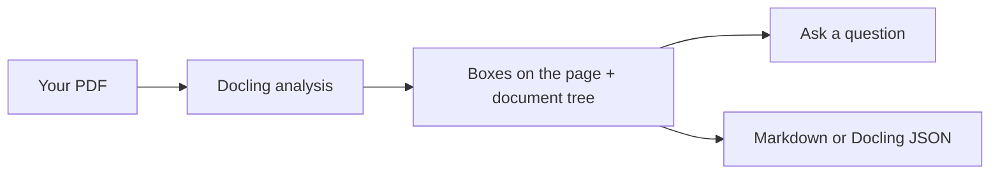

# Docling Studio

Docling Studio is a web app to see what [Docling](https://github.com/docling-project/docling) extracts from a PDF. Import a document, run an analysis, and check each title, paragraph, table and picture against the page it came from.



Try it with one command:

```bash
docker run -p 3000:3000 ghcr.io/scub-france/docling-studio:latest-local
```

Then open <http://localhost:3000>.

## Where to go next

| I want to… | Read |
|------------|------|
| Install and run it | [Get started](getting-started.md) |
| Learn the screens | [User guide](user-guide.md) |
| Change a setting | [Configuration](configuration.md) |
| Fix a problem | [Troubleshooting](troubleshooting.md) |
| Change the code | [Contributing](https://github.com/scub-france/Docling-Studio/blob/main/CONTRIBUTING.md), then [Architecture](architecture.md) |
| Publish a release | [Maintainers](maintainers.md) |

Docling Studio is open source under the [MIT license](https://github.com/scub-france/Docling-Studio/blob/main/LICENSE).
