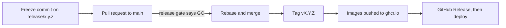

# Maintainers

## Release a version



1. **Audit.** Run the [quality audit](audit/master.md) on the release branch and fix what blocks.
2. **Freeze.** On `release/x.y.z`, make one commit `chore(release): freeze [x.y.z]` that:
    - renames `[Unreleased]` to `[x.y.z] - YYYY-MM-DD` in `CHANGELOG.md`,
    - sets `version` in `frontend/package.json`.
3. **Pull request.** Open `release/x.y.z` → `main`. The release gate runs and posts GO, GO CONDITIONAL or NO-GO as a comment. `main` needs one approval.
4. **Merge** with **Rebase and merge**.
5. **Tag** `main`:

    ```bash
    git checkout main
    git pull
    git tag vX.Y.Z
    git push origin vX.Y.Z
    ```

6. **Images.** The tag starts `release.yml`. It builds the `local` and `remote` images for amd64 and arm64 and pushes `X.Y.Z-*`, `X.Y-*` and `latest-*` to `ghcr.io/scub-france/docling-studio`. The `local` image includes the Ask packages.
7. **GitHub Release.** The workflow does not create it. Create it from the tag, with the version's section of `CHANGELOG.md` as notes:

    ```bash
    awk '/^## \[X.Y.Z\]/{f=1; next} /^## \[/{f=0} f' CHANGELOG.md > notes.md
    gh release create vX.Y.Z --title vX.Y.Z --notes-file notes.md
    ```

8. **Deploy** with the [deployment checklist](release/deployment-checklist.md).
9. **Next version.** Create the next release branch from `main`, and its milestone on GitHub:

    ```bash
    git checkout -b release/X.Y.Z main
    git push -u origin release/X.Y.Z
    ```

## What the release gate checks

It runs on every pull request to `main` and posts a verdict: GO, GO CONDITIONAL (only the dependency audit or the audit script failed), or NO-GO.

| Check | What it runs |
|-------|--------------|
| Lint and type-check | Ruff, ESLint, vue-tsc |
| Unit tests | pytest, Vitest |
| Dependency audit | pip-audit, npm audit |
| Audit script | `profiles/fastapi-vue/commands.sh` |
| Docker build | Both images |
| Smoke test | The remote image answers `/api/health` |
| Image scan | Trivy. Critical findings block. |
| Image size | Compared with the previous release. Warning only. |
| End-to-end | API (`@smoke`, `@regression`, `@e2e`) and UI (`@critical`) |

Known gaps in the workflow today: the unit-test steps pipe into `tee` without `pipefail`, so they cannot fail; the audit script is not in the repository; the Python audit never reports anything as critical. Lint and tests are still enforced by the CI checks required on `main`.

## Hotfix

1. Branch `hotfix/<issue>-<slug>` from `main`.
2. Fix, add a test, open a pull request to `main`, squash it.
3. Tag the next patch version on `main`, for example `v0.7.4`: the images follow.
4. Make sure the fix also lands in the open release branch.

## Checklists and references

| Topic | Page |
|-------|------|
| Merging pull requests | [Merge policy](git-workflow/merge-policy.md) |
| Commit messages | [Commit conventions](git-workflow/commit-conventions.md) |
| Reviewing | [Code review checklist](git-workflow/code-review-checklist.md) |
| Coding rules | [Coding standards](architecture/coding-standards.md) |
| Architecture decisions | [ADR guide](architecture/adr-guide.md) |
| Deploying, rolling back | [Deployment checklist](release/deployment-checklist.md), [Rollback playbook](release/rollback-playbook.md) |
| Incidents, security, monitoring | [Incident response](operations/incident-response.md), [Security response](operations/security-response.md), [Monitoring](operations/monitoring-checklist.md) |
| Triaging issues | [Issue triage](community/issue-triage-process.md) |
| Quality audit | [Audit master](audit/master.md) and its 12 checklists |
| Downloads from HuggingFace | [HuggingFace dependency map](architecture/huggingface-dependency-map.md) |
