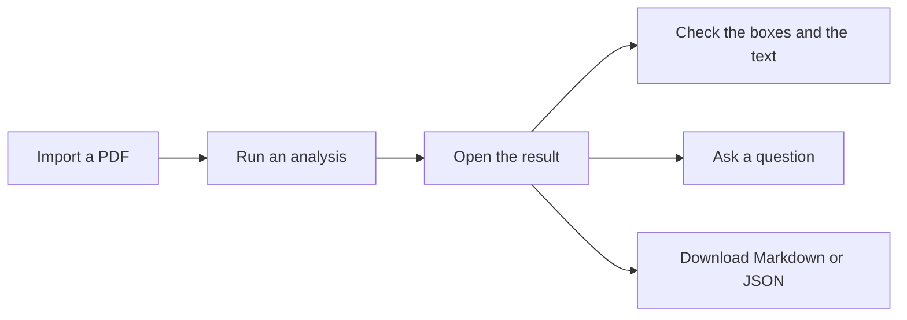

# User guide

Docling Studio runs [Docling](https://github.com/docling-project/docling) on a PDF and shows what it extracted: every title, paragraph, table, list and picture, with its box drawn on the page.

The interface starts in French. To switch to English, open **Paramètres** and set **Langue** to **EN**. This guide uses the English labels.

## The sidebar

| Item | What it is for |
|------|----------------|
| **Home** | Drop a PDF to import it. Shows counters and your 5 latest documents. |
| **Docs** | Your PDFs: import, open, download, delete. |
| **Analyses** | Every analysis: open the result, delete. |
| **Runs** | Nothing yet. The page says "Coming soon". |
| **Settings** | Theme, language, and the setup for **Ask**. |

## Import a PDF

1. Go to **Docs** and click **Import**.
2. Drop one or more PDFs, or click to choose them.
3. Wait until each file shows **Imported**.

Only PDFs are accepted; other files are skipped. Files over the size limit (50 MB unless your admin changed it) show **File too large**.

Importing does not analyze the PDF. That is the next step.

## Run an analysis

1. In **Docs**, click **Open visualization** on the document.
2. Click **New analysis**. The button shows **Analyzing…** while Docling works.

There are no options to choose here. The server settings apply: OCR on, table structure on, and the table mode set by the admin ("accurate" by default).

## Open the result

Go to **Analyses** and click **Open visualization** on the row. The status must be `COMPLETED`.

The result page has three panels:

- **Structure** (left): the document tree. Type in **Filter elements…** to narrow it, or use the button next to the title to expand or collapse everything.
- **Preview** (center): the pages, with a colored box on each element. For documents with several pages, switch between **Page** and **Scroll** at the top.
- **Properties** (right): the selected element. Its type, page and box position, then its text, or the table itself (**Open large** shows it bigger).

The **LAYERS** bar above lists each element type with its count. Click a type to hide or show its boxes.

### Select an element

Click a box on the page or a row in the tree. The element is selected in the three panels, and the other boxes fade out.

Click **Show all**, at the right end of the LAYERS bar, to see every box again.

## Ask a question

**Ask** sends a question about the document to a local model (through [Ollama](https://ollama.com)) and shows how the answer was built, step by step. It is off by default: see [Enable Ask](getting-started.md#enable-ask).

1. Open a result from **Analyses**.
2. In the right panel, click the **Ask** tab.
3. Type your question and press Enter, or click **Run**.

The answer shows up in the panel. Under the preview, the **Reasoning** timeline lists the steps the model took. Click a step to see the part of the document it read. Click an element to find the step that used it.

How it behaves:

- One question at a time. The answer arrives in one piece.
- Questions and answers live in your browser tab. They are not saved.
- Ask always reads the latest completed analysis of the document, even when you opened an older one.
- To use another model, type its name in **model override**. It applies to your next questions until you clear the field.

## Download

| From | Formats |
|------|---------|
| A result page (**Analyses**, then a row) | **Download**: PDF Document, Markdown, Docling JSON |
| The **Docs** list | PDF only |

## Delete

- A document: in **Docs**, click **Delete** on its row. Its analyses are deleted with it.
- An analysis: in **Analyses**, click **Delete analysis** on its row.

There is no undo.

## Not in the default screens

These features are in the code but no default screen reaches them in 0.7.3:

- chunking (splitting the text into pieces for a RAG pipeline),
- sending chunks to OpenSearch or Neo4j (deprecated, removed in 0.8.0),
- searching the chunks you sent (deprecated, removed in 0.8.0).

The older **Studio** pages still offer them. Start the server with `STUDIO_MODE_ENABLED=true` and open `/studio`. See [Configuration](configuration.md#feature-switches).
